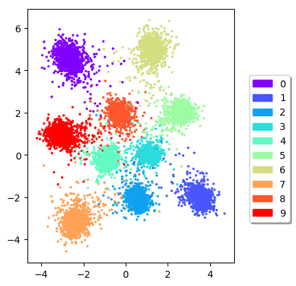
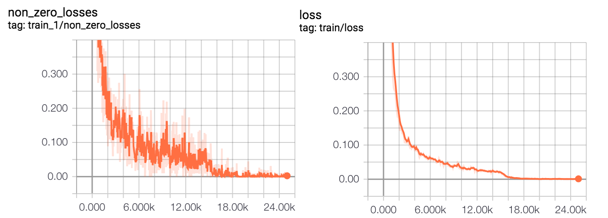
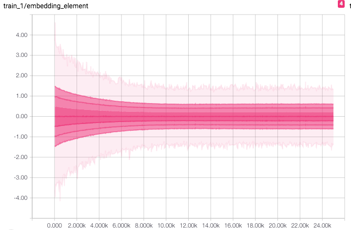

# Triplet Loss for Person Re-Identification

- TensorFlow implementation of person re-identification using triplet loss described in [
In Defense of the Triplet Loss for Person Re-Identification
](https://arxiv.org/abs/1703.07737).
- In this repository, the metric learning using triplet loss is tested on MNIST and [Market-1501 Dataset](http://www.liangzheng.org/Project/project_reid.html). For both dataset, batch hard mining is used during training, which is implemented in [src/triplet/hard_mining.py](src/triplet/hard_mining.py).
- Below are some results on [Market-1501 Dataset](http://www.liangzheng.org/Project/project_reid.html). From left to right: query image and top 10 retrieved images (green boarder - true positive; red border - false positive).


## Requirements
- Python 3.0
- TensorFlow 1.12.0+ 
- sklearn

## Metric Learning on MNIST
- The aim of this experiment is to check if the triplet loss using batch hard mining correctly implemented.
- The dimension of embedding is set to be 2 for visualization.
- As MNIST dataset is pretty simple, the network used to learn the embedding consists of 2 convolutional layers followed by 2 fully connect layers.
- For each batch, 12 samples of each class (0-9) are randomly selected. For triplet loss, margin = 0.5 is used.
- Below is the learned embedding of testing set after training for 50 epochs with learning rate 1e-4. We can see different classes are well grouped.



### Train embedding of MNIST by yourself
#### Setup path
- All the paths are setup in [`experiment/config.py`](experiment/config.py).
- `mnist_dir` - directory of MNIST dataset.
- `mnist_save_path` - directory of saving results.

#### Train
Go to `experiment`, run

 ```
 python train.py --dateset mnist --lr 1e-4 \
   --embed EMBEDDING_DIM \
   --margin MARGIN_VAL
 ```
 
- `--embed` is for dimension of embedding and `--margin` is for margin value of triplet loss
- If dimension of embedding is 2, the embedding visualization images will be saved in `mnist_save_path` for each epoch.

## Person Re-Identification on [Market-1501 Dataset](http://www.liangzheng.org/Project/project_reid.html)
- The network for learning embedding is the same as LuNet described in [
In Defense of the Triplet Loss for Person Re-Identification
](https://arxiv.org/abs/1703.07737).
- Images are rescaled to 128 x 64 and the intensity is normalized to [0, 1] before fed into the network.
- Batch size is 128 (randomly pick 32 identities with 4 images each). Embedding size is 128.
- Below is the training-log for 25000 training iteration. The initial learning rate is 5e-4 and margin = 0.5 is used.
Row 1: Left: non-zero loss ratio of hardest triplet at each training step; Right: averaged hardest triplet loss over 100 training steps at every 100 steps.
Row 2: Left: statistics of embedding entries; Right: statistics of 2-norm of embeddings.



- [Re-ranking](https://arxiv.org/abs/1701.08398) is used when retrieving images from gallery set given a set of query images.  
- Below are retrieve results given query images. From left to right: query image and top 10 retrieved images (green boarder - true positive; red border - false positive).


### Train and inference embedding for person re-identification on [Market-1501 Dataset](http://www.liangzheng.org/Project/project_reid.html)
#### Preparation
- Download the dataset from [here](http://www.liangzheng.org/Project/project_reid.html).
- Setup in [`experiment/config.py`](experiment/config.py):
- `market_dir` - directory of dataset.
- `market_save_path` - directory of saving results.

#### Train
Go to `experiment`, run

 ```
 python train.py --dataset market --lr 5e-4 \
   --embed EMBEDDING_DIM \
   --margin MARGIN_VAL \
   --folder FOLDER_NAME
 ```
 - `--embed` is for dimension of embedding, `--margin` is for margin value of triplet loss and `--folder` is for subfolder under `market_save_path` used for separating results of different experiments.
 - Summary file for Tensorboard visualization will be saved in `market_save_path/FOLDER_NAME/`.
 - The trained model will be saved in `market_save_path/FOLDER_NAME/` every 5000 training steps.
  
#### Inference and visualize ranking
Go to `experiment`, run

 ```
 python viz_ranking --dataset market \
   --embed EMBEDDING_DIM \
   --top_k TOP_K \
   --n_query NUM_QUERY \
   --folder FOLDER_NAME \
   --load_id MODEL_ID 
 ```
 - `--load_id` is for the index (training step when saved) of trained model to be loaded, `--n_query` is for the number of query images used for visualization and `--top_k` is for how many closest images in gallery set are selected as retrieved images for each query image.
 - `NUM_QUERY` query images will be randomly selected from testing set and rest of images are regarded as gallery set. Embedding of entire testing set (19732 images) will be computed before ranking.
 - Result images will be saved in `market_save_path/FOLDER_NAME/`.
 - The mAP increased around 10% after [re-ranking](https://arxiv.org/abs/1701.08398) is used. The re-rankning and evaluation code are borrow from [here](https://github.com/huanghoujing/person-reid-triplet-loss-baseline) currently.
 

## Reference code
- [https://github.com/omoindrot/tensorflow-triplet-loss](https://github.com/omoindrot/tensorflow-triplet-loss)
- [https://github.com/huanghoujing/person-reid-triplet-loss-baseline](https://github.com/huanghoujing/person-reid-triplet-loss-baseline)

## Author 
Qian Ge
